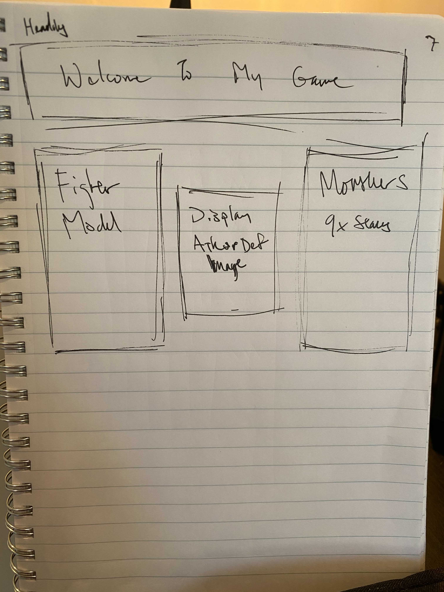
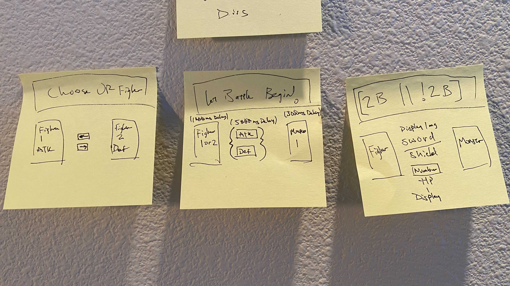

Title & Blurb
[2b || !2b]

Motivation
I am a very non-aggressive nonconfrontational person in real life, so this is a great outlet for those with same traits that want to vicariously explore life through the shoes of an aggressor/confronter in a fun way.

User Stories & Wireframes 
I. Upon initial loading, webpage displays: 
- game name in uppermost banner
II. User is able to select one of two fighter models
- one fighter has higher ATK one has higher DEF
- chosen fighter displays in middle left div
- monster displays on middle right div
- middle div toggles hidden and shows two buttons
III. User is able to choose between attack and defend
- upon user selection, buttons are hidden

IV. a)If user chooses to attack
- function run to subtract fighter attack from monster HP
- center div previously holding buttons will display fight attack
OR 
IV. b)If user choose to defend
- function run to subtract fighter defence from monster attack with nested function to negate remainder from fighter HP
- center div previously will show value if monster attack exceeds fighter defence

V. User can repeat (III & IV) until either fighter or monster Hp reaches zero.
- display victory or defeat in centerdiv
- new button appears beneath center div
VI. User can retry
- refreshes page (rinse/repeat)

git remote add origin https://github.com/ldb297/Project-1.git
git branch -M main
git push -u origin main